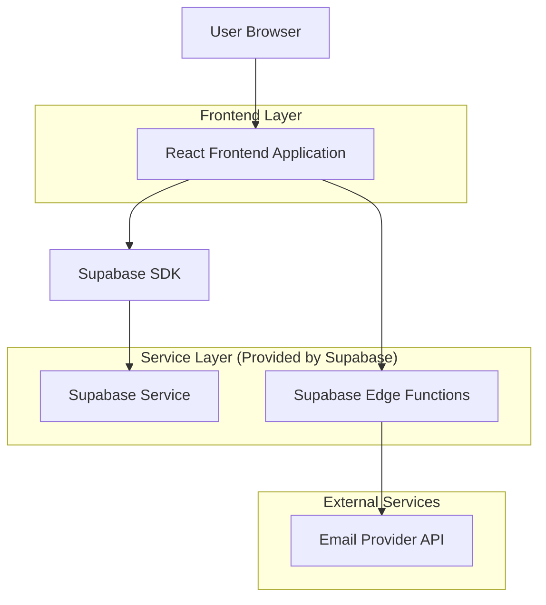
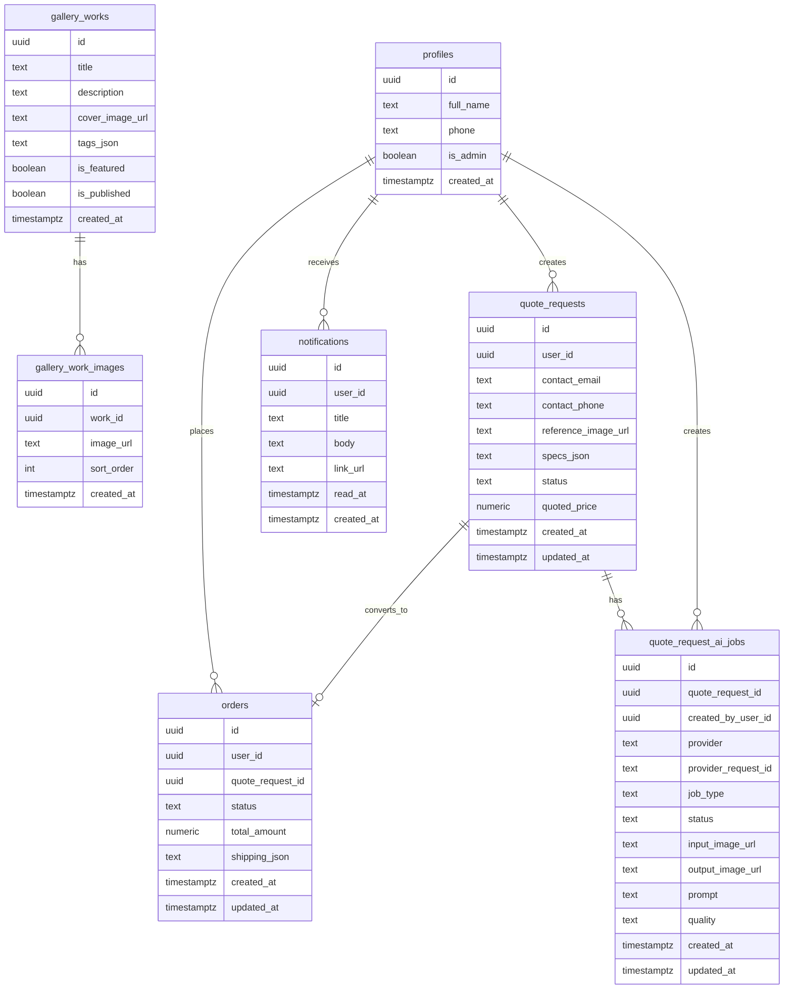

## 1.Architecture design


## 2.Technology Description
- Frontend: React@18 + vite + tailwindcss@3
- Backend: Supabase (Auth + Postgres + Storage + Edge Functions)
- Email: Proveedor transaccional (p.ej. Resend/SendGrid) llamado desde Edge Functions (API key en variables de entorno)

## 3.Route definitions
| Route | Purpose |
|-------|---------|
| / | Inicio / Galería (trabajos realizados) + CTA a personalización |
| /trabajos/:id | Detalle de trabajo (múltiples imágenes) |
| /personalizar | Subida de imagen + formulario de cotización/pedido |
| /mis-pedidos | Listado de solicitudes/pedidos y notificaciones |
| /mis-pedidos/:id | Detalle de solicitud/pedido |
| /login | Acceso |
| /registro | Registro |
| /admin | Home admin (atajos) |
| /admin/cotizaciones | Bandeja y gestión de cotizaciones |
| /admin/pedidos | Bandeja y gestión de pedidos |
| /admin/galeria | Gestión de trabajos (CRUD) e imágenes |

## 4.API definitions (If it includes backend services)
### 4.1 Edge Functions: IA (fal.ai) para previsualización y edición (solo calidad "mid")
La IA se integra con fal.ai desde el backend (Edge Functions) para generar una previsualización (“mockup”) y versiones editadas. La app no expone la API key al frontend.

Política de calidad:
- La aplicación solo permite "mid" (no existe opción de "high").

Notas operativas:
- Usar cola/webhook para evitar timeouts y para confiabilidad.
- Las URLs de medios devueltas por el proveedor pueden expirar; si se necesita persistencia, descargar/subir el resultado a Storage propio.

```
POST /functions/v1/ai-preview
```

Request (TypeScript):
```ts
type AiPreviewRequest = {
  quoteRequestId: string;
  referenceImageUrl: string;
  measures: { widthCm: number; heightCm: number };
  style?: { colors?: string[]; background?: "transparent" | "dark" | "light" };
  notes?: string;
};
```

Response:
```ts
type AiPreviewResponse = {
  ok: boolean;
  jobId?: string;
  provider?: "fal";
};
```

Edición (genera nueva versión a partir de una previa o imagen base)
```
POST /functions/v1/ai-edit
```

Request (TypeScript):
```ts
type AiEditRequest = {
  quoteRequestId: string;
  baseImageUrl: string;
  instructions: string;
};
```

Response:
```ts
type AiEditResponse = { ok: boolean; jobId?: string; provider?: "fal" };
```

Webhook fal.ai (resultado async)
```
POST /functions/v1/fal-webhook
```

Payload (TypeScript, simplificado):
```ts
type FalWebhookPayload = {
  request_id: string;
  status: "OK" | "ERROR";
  payload?: unknown;
};
```

### 4.2 Edge Function: enviar email de notificación
```
POST /functions/v1/send-notification-email
```
Request (TypeScript):
```ts
type SendNotificationEmailRequest = {
  to: string;
  subject: string;
  html: string;
  relatedEntity?: { type: "quote" | "order"; id: string };
};
```
Response:
```ts
type SendNotificationEmailResponse = { ok: boolean; messageId?: string };
```

## 6.Data model(if applicable)

### 6.1 Data model definition


### 6.2 Data Definition Language
Galería de trabajos (gallery_works)
```
CREATE TABLE gallery_works (
  id UUID PRIMARY KEY DEFAULT gen_random_uuid(),
  title TEXT,
  description TEXT,
  cover_image_url TEXT NOT NULL,
  tags_json TEXT,
  is_featured BOOLEAN NOT NULL DEFAULT FALSE,
  is_published BOOLEAN NOT NULL DEFAULT TRUE,
  created_at TIMESTAMPTZ NOT NULL DEFAULT NOW()
);

-- lectura pública (para ver la galería sin login)
GRANT SELECT ON gallery_works TO anon;
GRANT ALL PRIVILEGES ON gallery_works TO authenticated;
```

Imágenes de trabajos (gallery_work_images)
```
CREATE TABLE gallery_work_images (
  id UUID PRIMARY KEY DEFAULT gen_random_uuid(),
  work_id UUID NOT NULL REFERENCES gallery_works(id) ON DELETE CASCADE,
  image_url TEXT NOT NULL,
  sort_order INT NOT NULL DEFAULT 0,
  created_at TIMESTAMPTZ NOT NULL DEFAULT NOW()
);

CREATE INDEX idx_gallery_work_images_work_id_order ON gallery_work_images(work_id, sort_order);

GRANT SELECT ON gallery_work_images TO anon;
GRANT ALL PRIVILEGES ON gallery_work_images TO authenticated;
```

Perfiles (profiles)
```
CREATE TABLE profiles (
  id UUID PRIMARY KEY,
  full_name TEXT,
  phone TEXT,
  is_admin BOOLEAN NOT NULL DEFAULT FALSE,
  created_at TIMESTAMPTZ NOT NULL DEFAULT NOW()
);

GRANT ALL PRIVILEGES ON profiles TO authenticated;
```

Solicitudes (quote_requests)
```
CREATE TABLE quote_requests (
  id UUID PRIMARY KEY DEFAULT gen_random_uuid(),
  user_id UUID,
  contact_email TEXT NOT NULL,
  contact_phone TEXT,
  reference_image_url TEXT NOT NULL,
  specs_json TEXT NOT NULL,
  status TEXT NOT NULL DEFAULT 'En revisión',
  quoted_price NUMERIC(10,2),
  created_at TIMESTAMPTZ NOT NULL DEFAULT NOW(),
  updated_at TIMESTAMPTZ NOT NULL DEFAULT NOW()
);

CREATE INDEX idx_quote_requests_user_id ON quote_requests(user_id);
CREATE INDEX idx_quote_requests_created_at ON quote_requests(created_at DESC);

GRANT ALL PRIVILEGES ON quote_requests TO authenticated;
```

Jobs IA por solicitud (quote_request_ai_jobs)
```
CREATE TABLE quote_request_ai_jobs (
  id UUID PRIMARY KEY DEFAULT gen_random_uuid(),
  quote_request_id UUID NOT NULL REFERENCES quote_requests(id) ON DELETE CASCADE,
  created_by_user_id UUID REFERENCES profiles(id),
  provider TEXT NOT NULL DEFAULT 'fal',
  provider_request_id TEXT,
  job_type TEXT NOT NULL CHECK (job_type IN ('preview','edit')),
  status TEXT NOT NULL CHECK (status IN ('queued','in_progress','completed','failed')),
  input_image_url TEXT NOT NULL,
  output_image_url TEXT,
  prompt TEXT,
  quality TEXT NOT NULL DEFAULT 'mid' CHECK (quality IN ('mid')),
  created_at TIMESTAMPTZ NOT NULL DEFAULT NOW(),
  updated_at TIMESTAMPTZ NOT NULL DEFAULT NOW()
);

CREATE INDEX idx_ai_jobs_quote_request_id_created_at ON quote_request_ai_jobs(quote_request_id, created_at DESC);
CREATE INDEX idx_ai_jobs_provider_request_id ON quote_request_ai_jobs(provider_request_id);

GRANT ALL PRIVILEGES ON quote_request_ai_jobs TO authenticated;
```

Pedidos (orders)
```
CREATE TABLE orders (
  id UUID PRIMARY KEY DEFAULT gen_random_uuid(),
  user_id UUID,
  quote_request_id UUID,
  status TEXT NOT NULL DEFAULT 'Creado',
  total_amount NUMERIC(10,2),
  shipping_json TEXT,
  created_at TIMESTAMPTZ NOT NULL DEFAULT NOW(),
  updated_at TIMESTAMPTZ NOT NULL DEFAULT NOW()
);

CREATE INDEX idx_orders_user_id ON orders(user_id);
CREATE INDEX idx_orders_created_at ON orders(created_at DESC);

GRANT ALL PRIVILEGES ON orders TO authenticated;
```

Notificaciones (notifications)
```
CREATE TABLE notifications (
  id UUID PRIMARY KEY DEFAULT gen_random_uuid(),
  user_id UUID NOT NULL,
  title TEXT NOT NULL,
  body TEXT NOT NULL,
  link_url TEXT,
  read_at TIMESTAMPTZ,
  created_at TIMESTAMPTZ NOT NULL DEFAULT NOW()
);

CREATE INDEX idx_notifications_user_id_created_at ON notifications(user_id, created_at DESC);

GRANT ALL PRIVILEGES ON notifications TO authenticated;
```

Notas de seguridad (recomendado)
- Activar RLS y crear políticas: el cliente solo puede leer/escribir sus propias filas (quote_requests, orders, notifications) y el admin (profiles.is_admin=true) puede leer/editar todo.
- Bucket de Storage para imágenes de referencia: permitir subida solo a usuarios autenticados y lectura limitada (p.ej. URLs firmadas).
- Bucket de Storage para galería: lectura pública para imágenes publicadas y escritura solo admins (o solo vía Edge Functions).
