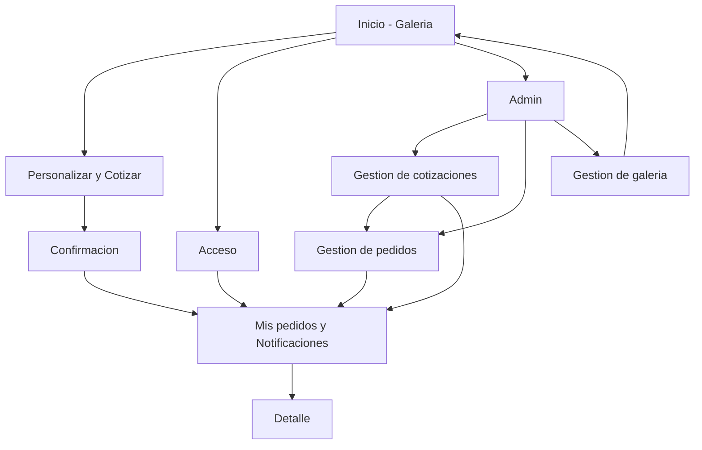
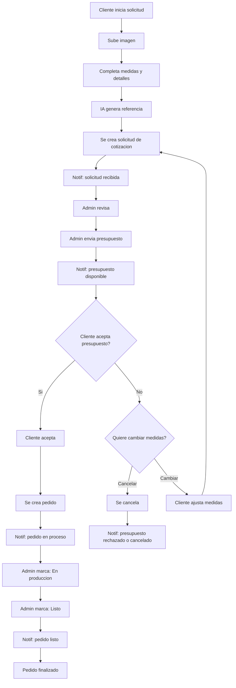

## 1. Product Overview

Tienda online para vender cuadros neón personalizados.
Permite subir una imagen de referencia, pedir cotización/pedido, y gestionar todo desde un panel admin con notificaciones in-app y por email.

## 2. Core Features

### 2.1 User Roles

| Rol     | Método de registro         | Permisos principales                                                                                   |
| ------- | -------------------------- | ------------------------------------------------------------------------------------------------------ |
| Cliente | Email + contraseña         | Ver galería de trabajos, solicitar cotización/pedido personalizado, ver estado, recibir notificaciones |
| Admin   | Usuario marcado como admin | Gestionar cotizaciones/pedidos, actualizar estados, enviar notificaciones                              |

### 2.2 Feature Module

La tienda se compone de las siguientes páginas principales:

1. **Inicio / Galería**: presentación de la marca, muestra de trabajos reales, CTA a personalización.
   - La galería funciona como “productos”: card con imagen y al entrar se ven más imágenes del trabajo.
2. **Personalizar y Cotizar**: subida de imagen, formulario de requisitos, envío de solicitud.
3. **Mis pedidos y Notificaciones**: listado de solicitudes/pedidos, detalle de estado, bandeja de notificaciones.
4. **Acceso (Login/Registro)**: autenticación de cliente.
5. **Admin**: bandeja de cotizaciones, bandeja de pedidos, actualización de estados y notificaciones.
   - Incluye gestión de galería (alta/edición/baja de trabajos e imágenes).

### 2.3 Page Details

| Page Name                    | Module Name             | Feature description                                                                                                                                                                   |
| ---------------------------- | ----------------------- | ------------------------------------------------------------------------------------------------------------------------------------------------------------------------------------- |
| Inicio / Galería             | Galería de trabajos     | Mostrar trabajos ya realizados (imágenes), con estilo “portfolio” y CTA “Cotizá tu diseño”.                                                                                           |
| Trabajo (detalle)            | Carrusel de imágenes    | Ver múltiples imágenes del trabajo (cover + adicionales), con zoom/slide y CTA a “Quiero uno así / Cotizar”.                                                                          |
| Inicio / Galería             | Navegación              | Navegar a Personalizar, Mis pedidos, Login/Registro (según sesión).                                                                                                                   |
| Personalizar y Cotizar       | Subida de imagen        | Subir imagen (JPG/PNG) y previsualizar; validar tamaño/formato; guardar en almacenamiento.                                                                                            |
| Personalizar y Cotizar       | Referencia por IA       | Generar una imagen de referencia/“mockup” del neón basada en la imagen subida (para el cliente y para producción). Se integra con fal.ai y se fija calidad "mid" (sin opción "high"). |
| Personalizar y Cotizar       | Formulario de solicitud | Capturar medidas aproximadas, colores/estilo, texto opcional, notas, y email/teléfono; crear solicitud.                                                                               |
| Personalizar y Cotizar       | Confirmación            | Confirmar envío y mostrar número de solicitud y próximos pasos.                                                                                                                       |
| Mis pedidos y Notificaciones | Mis solicitudes/pedidos | Listar solicitudes/pedidos con estado (p.ej. “En revisión”, “Cotizado”, “En producción”, “Listo”, “Enviado”).                                                                         |
| Mis pedidos y Notificaciones | Detalle                 | Ver detalle de solicitud/pedido: requisitos, imagen, cotización (si existe), historial de cambios.                                                                                    |
| Mis pedidos y Notificaciones | Notificaciones in-app   | Ver notificaciones, marcar como leídas, navegar al detalle relacionado.                                                                                                               |
| Acceso (Login/Registro)      | Registro                | Crear cuenta con email/contraseña y aceptar términos básicos.                                                                                                                         |
| Acceso (Login/Registro)      | Login/Logout            | Iniciar/cerrar sesión; recuperación de contraseña.                                                                                                                                    |
| Admin                        | Gestión de cotizaciones | Ver solicitudes, asignar precio/nota, cambiar estado a “Cotizado”, y notificar al cliente (in-app + email).                                                                           |
| Admin                        | Gestión de pedidos      | Crear/actualizar pedido desde una cotización, actualizar estados, y notificar al cliente (in-app + email).                                                                            |
| Admin                        | Gestión de galería      | Crear/editar trabajos: título opcional, tags, destacado, publicar/ocultar. Subir múltiples imágenes, ordenar, definir portada.                                                        |
| Admin                        | Seguridad de acceso     | Restringir acceso solo a admins autenticados.                                                                                                                                         |

## 3. Core Process

**Flujo Cliente**

1. Entra al Inicio y ve la galería de trabajos ya realizados. 2) Va a Personalizar y sube imagen + completa requisitos (incluye medidas). 3) Recibe una referencia generada por IA (fal.ai, calidad fija "mid") para alinear expectativas. 4) Envía solicitud y recibe confirmación. 5) Revisa cambios de estado y presupuesto en “Mis pedidos”. 6) Si rechaza el presupuesto, puede cancelar o ajustar medidas y reenviar.

**Flujo Admin**

1. Entra al Admin. 2) Revisa nuevas solicitudes. 3) Define precio y estado, y envía notificación. 4) Convierte a pedido y actualiza estados operativos, notificando cada cambio.

Diagrama (Mermaid):

 

 

### 3.1 Flujo de pedido (creación -> confirmación -> finalización)

Política IA:

- La app genera previsualizaciones y ediciones con fal.ai.
- Calidad fija: "mid" (no existe opción de "high").
- Límite recomendado: 1 previsualización + hasta 2 ediciones por solicitud (ajustable por admin).

Diagrama (Mermaid):

